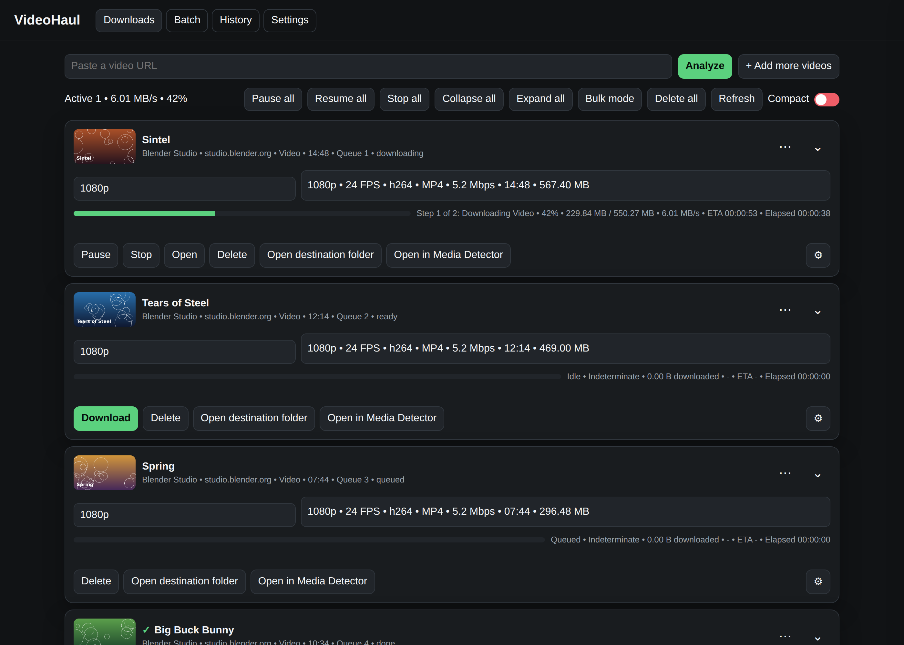
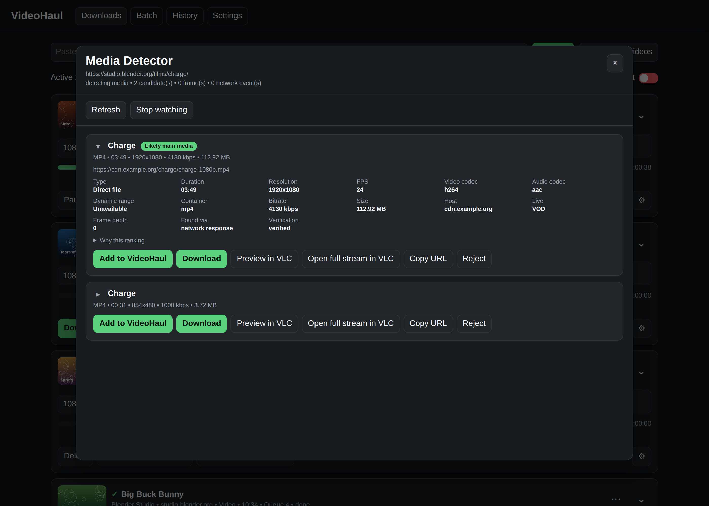

# VideoHaul

VideoHaul is a desktop media downloader. Paste a URL, analyze it, choose a quality, and download.

Made by **Anas Al Hwaity**.



## Run

Requires Python 3.10–3.14.

```bash
python VideoHaul.py
```

On Windows, VideoHaul can prepare and reuse yt-dlp, FFmpeg/FFprobe, Deno, and Chromium when they are needed. You can also install the package with `python -m pip install .` and run `videohaul`.

## Download something

1. Paste a video or playlist URL.
2. Click **Analyze**.
3. Choose the resolution and stream.
4. Click **Download**.
5. Follow the real byte count, speed, ETA, elapsed time, and current stage on the job card.

VideoHaul does not call a transfer complete until the finished output has been finalized and validated.

## Media Detector

If a page reveals its media only after you press Play, dismiss an overlay, or choose a server, click **Open in Media Detector** and use the page normally. VideoHaul watches the browser session and lists the media it can verify. Reopening the detector for the same active job reuses that session instead of spawning another window.



Detected media can be added to VideoHaul, downloaded, copied, or previewed in an already installed VLC.
On first use, VideoHaul can install its managed Playwright Chromium once and reuse it for later detector sessions.

## Jobs, batch and recovery

VideoHaul supports multiple jobs, playlists and batch input, configurable concurrency, pause/resume/stop/retry, speed limits, history, duplicate detection, and interrupted-download recovery.

Each job can keep its own output, subtitle, audio, retry, metadata, thumbnail, authentication, and file-handling choices.


## Settings

Global settings cover downloads, concurrency, bandwidth sharing, appearance, completion actions, browser/session behavior, diagnostics, and recovery. Bandwidth limits are disabled by default; a blank speed limit means unlimited.


## Browser dashboard

The desktop app and local browser dashboard use the same backend, queue, database, and download engine. Run `videohaul --browser` to open the dashboard on `127.0.0.1` with a per-launch access key.

## Privacy and use

VideoHaul has no account system, cloud service, or telemetry. The Media Detector does not bypass DRM, subscriptions, or authentication you do not already have. Use VideoHaul only for media you are allowed to access and download.

## License

MIT. See [LICENSE](LICENSE) and [THIRD_PARTY_NOTICES.md](THIRD_PARTY_NOTICES.md).
